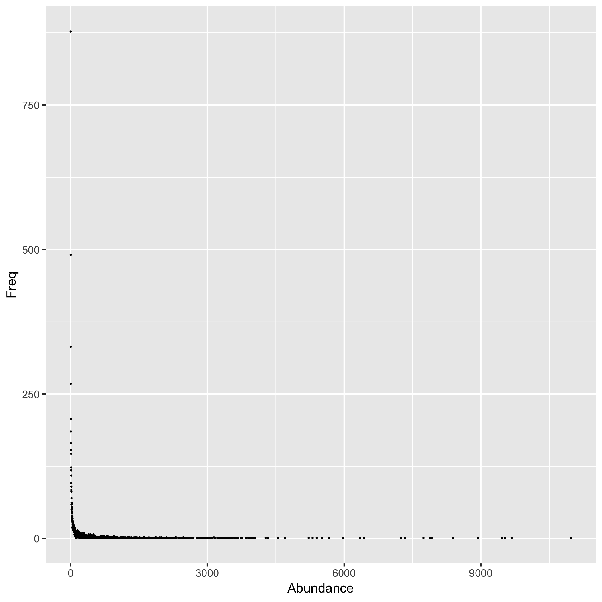
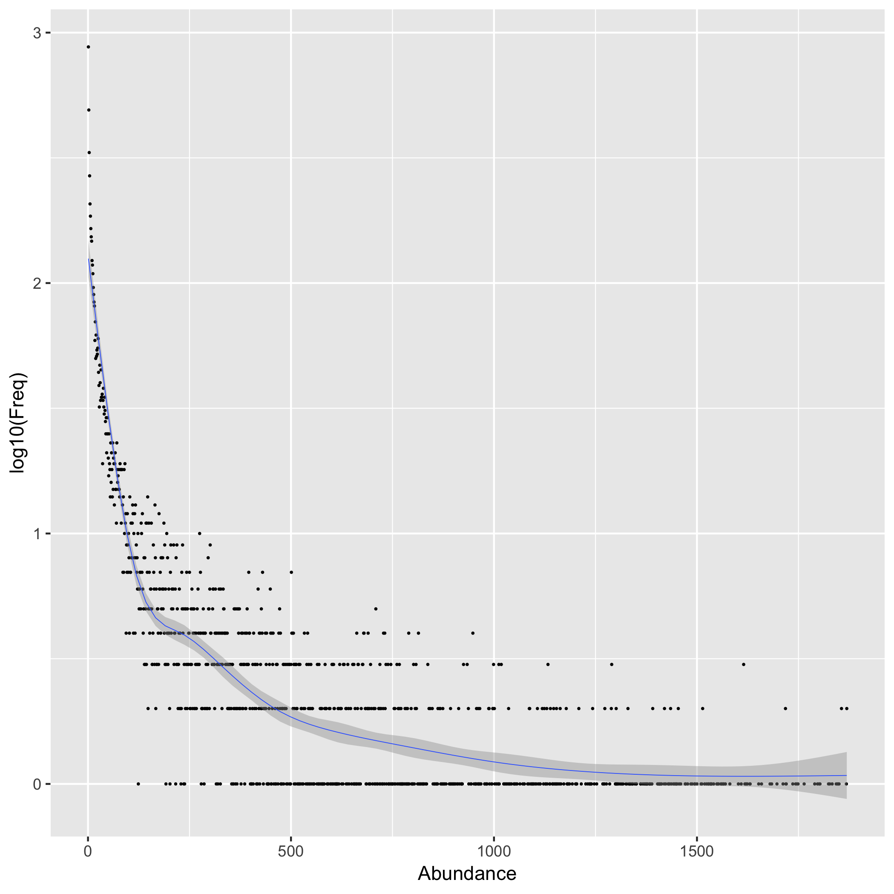

## n-grams

From [wikipedia](https://en.wikipedia.org/wiki/N-gram):

> In the fields of computational linguistics and probability, an n-gram is a contiguous sequence of n items from a given sample of text or speech.

There are many applications of n-grams, however I am much more familiar with n-grams in the field of computational biology, where they're called k-mers. There are many useful things that can be learned from the set of n-grams from a text or a biological sequence. If you're interested, I encourage you to follow the link to the Wikipedia article above.

Abundance histograms of n-grams is often useful for downstream analysis of a text. An abundance histogram describes the frequency of n-grams that occur n times.

### A short example

For example for a text: "Thisistextextext" The set of 3-grams would be:

```
Thi
his
isi
sis
ist
tex
ext
xte
```
The abundance of 3-grams is:

```
3-gram  Abundance
Thi 1
his 1
isi 1
sis 1
ist 1
tex 3
ext 3
xte 2
```

So the resulting abundance histogram is:
```
Abundance Freq
1 5
2 1
3 2
```

In this report, I will quickly present 2 plots of abundance histograms of 3-grams for all words found in Webster's Second International dictionary.


## Plots




It's hard to get much information out of this plot. Clearly the data is exponentially distributed, so let's log(y) and fit a LOESS line.


